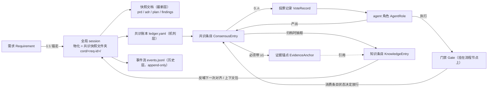

# 02 · 需求定义

> 参考性质：历史需求模型与指标设计。当前实现范围见 [`./current-architecture.md`](./current-architecture.md)。

> **状态：历史需求模型。** 本文保留目标、范围和需求基线；当前实现范围见 `docs/current-architecture.md`。
>
> 读者：第一次接触本项目的外部开发者。

**本章回答什么问题**：agent-cord 的目标如何度量（以及为什么"零推翻率"和"难题桶 100% 一致"都是警报）？第一阶段做什么、不做什么？系统里的八个核心实体各自是什么、有哪些关键字段、状态如何流转？「全局 session」和「共识快照文件夹」到底是什么关系？需求的全量清单（R1–R12）是什么？全文使用的术语如何统一？

---

## 1. 目标与度量取向

### 1.1 主目标与次级收益

**主目标：建立共识。** 让「系统应该怎么表现」的每一个结论都带证据、可度量、可复核，从而减少人因信息不对称、上下文缺失、变更遗漏而被迫介入的不必要卡点。

次级收益（顺势获得，不作为目标）：缩短前期对齐时间、降低 AI 输出校验负担。

这个口径来自一条已确认的定位修订：**共识是目标本身，而不是省时间的副产品**（见 [`./01-vision.md`](./01-vision.md) §7 已形成共识第 1 条）。口径决定度量取向——如果把目标写成"省时间"，设计会被推向削减人介入次数的竞赛，最终复刻重型流程平台的死法。

因此度量分两组：**共识质量**（结论可不可信）与**人介入负担**（这套机制是不是在收税）。两组同时健康，平台才成立。

### 1.2 共识质量：三个指标

| 指标 | 定义与口径 | 健康解读 |
|---|---|---|
| **证据覆盖率** | 共识条目中带 ≥1 个**有效**证据锚点的比例。有效性判定只用**符号锚点**（可解析，参与锚点求交）与**锁定 commit 的内容快照**（坐标处内容匹配，用于存档与复现）；`文件:行号` 只是显示层，不参与判定。机械可查 | 目标 **100%**，是硬门槛而非追求值；达不到说明锚点机制有洞 |
| **独立一致度** | 三层口径：①**原始一致率**（辅指标）：k 个 agent 全票一致或多数成立的决策点比例；②**机会校正一致度**（主指标）：k=3 用 Fleiss' κ（≥0.61 有效 / 0.41–0.60 勉强 / <0.40 机制需重设计），同时报 Gwet's AC1 防 prevalence paradox，缺票时用 Krippendorff's α；③**一致但错率**（≤10% 绿 / 10–20% 黄 / >20% 红）：投票一致但结论与人工结论不符的比例 | 必须**按决策点难度分桶统计**，并与推翻率联合解读；固定健康区间（如 70–90%）无文献依据 |
| **推翻率** | 观察期内 `confirmed` 条目被标记 `overturned` 的比例，按原因分类：证据不足 / 语义理解错 / 需求变更 / 外部依赖变化 | **零推翻率是警报**；推翻率高的条目类别自动降置信度、强制投票 |

两个反直觉口径值得展开，因为它们是本方案度量设计的核心：

- **零推翻率不是满分，是警报。** 它说明验证信号太弱或观察期太短——没有任何结论被推翻，通常意味着没有人有动力/渠道去推翻它。方案为此配套两条机制：推翻不追责（指标用于改进机制，不用于评价个人或 agent，否则指标会被博弈成"条目标低置信度逃责"），以及对"应被推翻而未被发现"的条目的抽查审计。另外，**被推翻的结论本身也是知识**：条目改 `overturned` 后保留全文。
- **100% 一致在难题桶里是警报而不是健康信号。** 一致率与任务难度强耦合：在超出模型能力的决策点上，模型会系统性地一致趋向错误答案（预注册研究实测：GPQA Diamond 上多数投票使 56.6% 的题目准确率反而下降）。因此独立一致度不能用一个固定区间判定健康，必须分难度桶、并与推翻率联合解读。这也是**难度门**存在的理由：投票只用于"非重点 + 可机验 + 可逆"的决策点。

补充一条口径纪律：**推翻率是纵向指标**（观察期内 `confirmed` → `overturned`），回放类实验测不出真正的推翻率，只能给出历史决策集中被推翻条目的构成比（描述性统计），两者不得混用。

### 1.3 人介入负担：四个指标

| 指标 | 定义 | 用途 |
|---|---|---|
| Issue 密度 | 每个需求产生的介入问题（选择题）数量 | 最直观的流程负担指标 |
| 单介入耗时 | 人从收到选择题到作答的时长 | 与问题设计质量联动：如果人需要大量补充阅读，说明问题没被设计成选择题 |
| 跨角色介入总负担 | 每人每天收到的选择题数量 | 需设告警阈值，防止"选择题疲劳"——介入次数上升是平台的隐性死法 |
| **Issue 密度随需求序号衰减** | 同一业务线上，第 N 个需求的 Issue 密度应随 N 递减 | **这是知识沉淀生效（自进化飞轮）的直接证据**；密度不衰减说明流程在收税而不是在放大效率 |

### 1.4 目标与机制的关系

度量不是事后报表，而是机制的输入：证据覆盖率对应"无证据不入账"的硬门槛；独立一致度对应投票的难度门与放行规则；推翻率对应知识条目的降置信度与强制投票；Issue 密度对应门禁触发器的校准与知识库的补全。指标口径一旦调整，机制参数随之调整——所以本节的口径是规范化定义，不是可选项。

---

## 2. 范围

### 2.1 第一阶段做

作用域 = **单个需求**（全局 session 的锚定单位 = 需求）：

1. 单需求全局 session（上下文贯通、变更同步）；
2. 共识账本与三指标度量；
3. 提交前置校验钩子（文档防腐）；
4. 可插拔流程门禁（含触发式升级）；
5. 通用投票机制（agent 间协作标准化的第一个协议）；
6. 群聊交互层 + 单机器人路由（首个用例 = 项目协作群自身，dogfooding）。

### 2.2 第一阶段不做

1. 零人工全自动开发；
2. 跨需求调度与多需求并发编排；
3. 绑定特定公司协作工具的实现（通用层只定义协议，具体对接留给适配器与示例插件）；
4. 重型固定流程模板。

注意"不做"的两种性质：第 1、4 条是**永久边界**（由定位与设计公理决定）；第 2、3 条是**阶段边界**（作用域与接入顺序决定，接口为其预留）。把两类混为一谈会导致两种错误——把边界当阶段目标去追（激进全自动），或把阶段边界当永久约束而放弃扩展性。

---

## 3. 领域模型

### 3.1 地基：全局 session 与其物化形态

> **全局 session 是逻辑概念，共识快照文件夹是它的物化形态；二者是同一实体的两面——session 的锚定单位是单个需求，即「一个需求 = 一个全局 session = 仓库内一个 `cord/<req-id>/` 文件夹」。**

这个等式是全方案的地基：它同时决定了作用域（单需求）、SSOT 的物理位置（仓库内、与代码同仓、clone 即拥有全部共识）和人机协作的接口（文件夹人可读可改，机判数据在结构化层）。

共识快照文件夹由**四层**构成，每层的生命周期与权威性不同：

| 层 | 载体 | 是否可编辑 | 是否清理 | 职责 |
|---|---|---|---|---|
| 最新层 | 快照文档：`prd.md` / `adr.md` / `plan.md` / `findings.md` | **允许人工直接编辑** | **允许主动清理（瘦身）** | 显示与协作的最新视图；frontmatter 仅作状态/版本戳 |
| 机判层 | `ledger.yaml`（共识账本） | 只经写入协议变更 | 不清理（`overturned` 保留全文） | 所有机判逻辑的数据源：条目状态机、证据锚点、投票记录 |
| 历史层 | `events.jsonl`（事件流，append-only） | **永不编辑** | **永不清理** | 唯一的事实与顺序来源；留痕与审计 |
| 版本化权威 | git（快照文件夹与代码同仓） | 经 PR 合入 | — | 每一次状态变化都可 diff、可评审；人工合入的载体 |

关键规则三条，后续所有章节都依赖它：

1. **判定一律查事件流/账本，快照文档的 frontmatter 只是显示层，不参与判定。** 理由：frontmatter 的权威会与 git 真实历史漂移，双写权威必然产生分歧。
2. **事件流永不进 LLM 上下文。** agent 只消费投影（快照文档 + 上下文包）；事件流给人审计、供程序查询。把完整历史塞进 prompt 会稀释注意力，反而降低判断质量。
3. **快照文档可以放心清理，因为历史不在这一层。** 这正是"主动清理历史"与"事件溯源"这两个看似矛盾的要求能够共存的原因：分层即化解。

标准目录布局（权威定义见 [`./03-architecture.md`](./03-architecture.md) §5.1）：

```
cord/                              # SSOT 根目录（与代码同仓）
├── <req-id>/                      # 一个需求一个共识快照文件夹
│   ├── prd.md                     # frontmatter: id / 状态 / 版本戳（显示层）
│   ├── plan.md                    # 同上
│   ├── adr.md                     # 决策记录；被取代的决策保留 supersede 链接
│   ├── findings.md                # 调研与实验结论（临时身份的结论住在这里）
│   ├── ledger.yaml                # 共识账本：条目 + 状态机 + 证据锚点 + 投票记录（机判层）
│   ├── votes/                     # 投票记录全文（V-xxxx.yaml），与账本内嵌记录以 vote_id 对齐
│   └── events.jsonl               # append-only 事件流（历史层，永不清理）
├── knowledge/                     # 跨需求知识条目（KB-xxxx，每条目一文件），供后续需求检索引用
├── .index/                        # 派生索引（SQLite FTS5）：gitignore，可 `kb reindex` 重建
└── cord.toml                      # 布局版本、事件 schema 版本、索引配置
```

三条与账本相关的写入规则（硬约定，不满足则不许入账）：

1. **无证据不入账**：每条结论必须带至少一个证据锚点（代码符号、用例 id 或知识条目 id），禁止无锚点结论。
2. **状态机单向流转**：状态一律用英文机读 token（`provisional` / `confirmed` / `overturned`，中文叙述统一写「临时（provisional）」），流转只能前进：临时（`provisional`）→ `confirmed` → `overturned`；回退必须附新证据走推翻流程。这防止"迁就实现改共识"——实现与共识冲突时，要么改实现，要么留痕推翻。
3. **临时身份默认**：调查结论在得到证据前不晋升为事实，防止把历史偶然性"认知洗白"为正式需求。

### 3.2 八个核心实体

| 实体 | 定义 | 关键字段 | 状态机 |
|---|---|---|---|
| **需求 Requirement** | 工作单元；全局 session 的锚定对象 | `req-id`、目标、验收边界、联系人 | 草稿 → 对齐中 → 执行中 → 验收 → 归档 |
| **全局 session ⇄ 共识快照文件夹** | **同一实体的两面**：单需求全生命周期的结构化状态，唯一事实来源；物化为 `cord/<req-id>/`（见 §3.1） | 需求 id、快照文件夹路径、快照文档集、`ledger.yaml`、`events.jsonl` | active → paused → archived |
| **共识条目 ConsensusEntry** | 带证据、可独立复核的结论；共识账本的基本单位，本质是 ADR 的字段增强版而非新文档类型 | `id`、需求、结论、证据锚点[]、状态、置信度来源（代码验证 / 投票一致 / 人确认）、投票记录、推翻记录、关联动作[] | 临时（`provisional`）→ `confirmed` → `overturned`（单向；回退须附新证据）；机读 token = `provisional` / `confirmed` / `overturned` |
| **证据锚点 EvidenceAnchor** | 结论与代码/用例/知识条目的连接点；防腐钩子与锚点独立度检查的抓手 | 类型（代码 / 用例 / 知识库条目）、**符号锚点（活，参与判定）**、**commit SHA（存档）**、**行号（仅显示层）**、说明 | 有效 → 失效（漂移）→ 重验；失效即触发条目降回临时（`provisional`）身份 |
| **门禁 Gate** | 流程节点上的可配置检查点，定义"什么角色、在什么时机、执行什么校验、结果写回哪里" | 挂载节点、角色（由 `pass.human_confirm` / `escalate.approve_by` 声明）、时机（触发器）、`checks[]`（校验器）、放行条件、结果语义（`pass` / `block` / `warn-and-continue`）、失败动作 `on_fail`（`block` / `warn` / `escalate`；`escalate` 直接进升级流程，不产生第四种结果）、写回目标 `write_back`（封闭枚举）、权限声明 | 启用 / 停用 |
| **agent 角色 AgentRole** | 绑定知识源与能力边界的执行单元（探索/实现/验证/评审等） | `id`、`role`、模型档位（tier）、异构约束（`heterogeneous_with`）、`context_sources`、inputs/outputs（结论 + 证据锚点 + 置信度）、约束（盲评、无证据不入账）、兜底联系人 | 无状态机（注册制：注册 / 注销） |
| **投票记录 VoteRecord** | 一次独立盲评投票的完整留痕，是账本条目 `投票记录` 字段的载体 | 决策点（结构化选项集、难度桶、可机验性）、`k`、各票（agent、provider、`model_id@version`、`prompt_hash`、选项置换、结论、锚点、置信度、usage）、统计（原始一致率、Fleiss' κ、Gwet's AC1、锚点重合度）、判定、少数派理由 | 判定三态：`confirmed` / `needs_verification` / `escalated_anchor_overlap`（升级人工是动作、不是第四种结果）；记录本身不可变 |
| **知识条目 KnowledgeEntry** | 跨需求沉淀的可复用规则/术语/踩坑 | `KB-xxxx`（终身不改）、`schema_version`、`type`(rule/term/pitfall/convention)、`title`、`status`、`confidence`、`tags`、`source_anchors[]`（锚点统一 `{kind, anchor}`）、`verified_by`、`supersedes` / `contradicts`、`applies_to`、`created` / `last_reviewed` / `review_due` | 候选（candidate）→ 生效（active）→ 过期（deprecated）/ 废止（retired）；软删除：`status: retired`，全文保留，检索默认排除，注入永不允许 |

### 3.3 关键字段 schema（设计稿）

以下 schema 是设计意图的精确表达，供实现与评审对照。

**共识条目（`ledger.yaml` 中的一项）**

```yaml
id: C-002
需求: <req-id>
结论: <一句话结论>
证据:                                  # 硬门槛：无证据锚点不许入账
  - {类型: 代码, 符号锚点: "src/rules/Evaluator.java#RulesEngine.evaluate",
     commit: "<sha>", 行号: 412, 说明: "..."}     # 行号仅显示
  - {类型: 知识库, 锚点: "KB-0017", 说明: "..."}
状态: confirmed                        # 临时（provisional）→ confirmed → overturned（单向；机读 token 即这三个）
置信度来源: 投票一致                    # 枚举：代码验证 / 投票一致 / 人确认
投票记录:                              # 见下方 VoteRecord schema
  决策点: {id, 选项集, 难度桶, 可机验性}
  k: 3
  各票: [{agent_id, provider, model_id@version, prompt_hash, 选项置换,
          结论, 证据锚点[], 置信度, usage}]
  统计: {原始一致率, fleiss_kappa, gwet_ac1, 锚点重合度}
  判定: needs_verification             # confirmed | needs_verification | escalated_anchor_overlap
  少数派理由: null                      # 2:1 分裂时必须非空
推翻记录: []                           # 空是健康信号，非零也是（被推翻的结论也是知识）
关联动作: [<依赖本条目的用例/检查点>]    # 只有 confirmed 才允许驱动不可逆动作
```

**证据锚点三层**

| 层 | 形态 | 是否参与判定 | 理由 |
|---|---|---|---|
| 符号锚点（活） | 文件路径 + 顶层符号路径，如 `src/rules/Evaluator.java#RulesEngine.evaluate` | **是**（锚点求交、独立度比较只用这一层） | 抗重构，行号漂移不影响 |
| commit SHA（存档） | 结论成立时的代码快照 commit | 否（用于复现与存档） | 让"当时看到的是什么"可回放 |
| 行号（显示层） | `文件:行号` | **否** | 只给人定位；会漂移，也可能巧合重合 |

**门禁（gate）**

```yaml
apiVersion: agent-cord.dev/gates/v1        # 门禁 schema 的权威定义见 06 章 §2.2
kind: Gate
metadata: {id: contract-freeze, name: 契约冻结门禁}
spec:
  attach:                               # 时机要素：挂载节点 + 前后 + 声明式触发器（可叠加）
    node: execution
    when: pre                           # pre | post
    triggers: [contract.touched, vote.split]
  checks:                               # 校验要素：新增门禁 = 组合已有校验器
    - ref: contract-consistency@official
    - ref: vote-consensus@official
      with: {k: 3, difficulty_gate: non_critical}
  pass: {require: all, human_confirm: true}   # 放行要素：契约冻结属不可逆动作，必须人工确认
  on_fail: block                        # 失败动作：block | warn | escalate（escalate 直接进升级流程，不产生第四种结果）
  timeout: {after: 24h, on_timeout: escalate_human}   # 超时按升级人工处理，不放行
  permissions: {write: [consensus_ledger]}      # 权限声明：最小写权限（不含群消息、不含 git）
  write_back: [consensus_ledger, session_event] # 写回目标（封闭枚举）：consensus_ledger | session_event | doc_block_draft | knowledge_entry
  link_entry: auto                      # 写回必须回链共识条目 id
```

四要素在 schema 上的落点：**角色**由 `pass.human_confirm` 与 `escalate.approve_by` 声明（谁确认、谁审批，改门禁的人不能自批），**时机** = `attach`，**校验** = `checks`，**放行** = `pass` + `on_fail`；`write_back`（写回目标）与 `permissions`（最小权限）是 schema 上的两个必需字段。

**事件（`events.jsonl` 的一行）**

envelope 的权威定义在 [`./03-architecture.md`](./03-architecture.md) §3.1，此处只给形态示意：

```jsonc
{ "event_id": "01J9Z3K7...",            // ULID，全局唯一；消费端幂等去重键
  "seq": 128,                           // 单 session 内单调递增，顺序的唯一依据
  "type": "ledger.entry.confirmed",
  "schema_version": "1",
  "timestamp": "2026-09-24T12:00:00.000Z",
  "actor":  { "kind": "human|agent|system", "id": "...", "display": "..." },
  "session_id": "<req-id>",              // 全局 session（= 需求文件夹）
  "correlation_id": "01J9Z3K7...",
  "source": { "adapter": "feishu|slack|discord|cli|system",  // 入站按 raw_id 去重
              "raw_id": "...", "channel": "..." },
  "payload": {...} }
```

事件流是**唯一的事实与顺序来源**：所有写事件（CLI、git hook、IM 路由、agent 工具调用）必须汇聚到单一的 append 入口，才能保证留痕不被绕过、时间戳规范化、凭证脱敏默认开启（事件流会进 git，一次误粘贴的凭证会永久留在历史里）。

**知识条目（frontmatter）**

字段的权威定义见 [`./08-self-evolution.md`](./08-self-evolution.md) §8.2.2：

```yaml
schema_version: kb/v1
id: KB-0017                    # 终身不改；文件名可含标题，但解析以 id 为准
type: rule                     # rule | term | pitfall | convention
title: ...
status: active                 # candidate | active | deprecated | retired
confidence: 0.8                # 参与检索排序加权，不做硬过滤
tags: [...]
source_anchors:                # 硬门槛：至少一条；锚点字段统一 {kind, anchor}
  - {kind: symbol, anchor: "src/rules/RuleEvaluator.ts#evaluate"}
  - {kind: kb,     anchor: "KB-0009"}
verified_by: [...]             # 复述检验的产物与留档（怎么通过检验的，本身可审计）
supersedes: []
contradicts: []
applies_to: [rule-engine]      # 适用域标签，供前置高信号层做域过滤
created: 2026-09-24
last_reviewed: 2026-09-24
review_due: 2027-03-24
```

知识条目的生命周期全部复用已有机制，不新造：候选→生效需要三个条件同时满足——复述检验通过、证据锚点机验有效、人工在 IM 侧点确认（合入永远人工的边界在此自然落地）；生效→过期/废止由时间（`review_due`）与信号（被引用时锚点失效、推翻记录命中、关联代码删除）双触发，走同款门禁 + 人工确认，废止留痕、全文保留。

### 3.4 实体关系



用文字表述同一条关系链（与上图等价）：

- **需求 1:1 全局 session**；session 聚合共识条目，并由快照文档（最新层）、账本（机判层）、事件流（历史层）三层物化，git 提供版本化权威；
- **共识条目 1:n 证据锚点、0:n 投票记录**；投票记录由多个 agent 角色（必须异构）产生，判定结果反写条目状态；
- **门禁挂在流程节点上**，消费共识条目的状态决定放行/拦截/升级；门禁由角色 agent 执行；
- **知识条目由账本条目与推翻记录抽取而来**（需求归档时抽取，不是移动），与账本保持分离但以锚点互链：账本条目引用 `KB-xxxx`，知识条目引用其 `source_anchors`。两者分离的原因：账本条目是"按需求组织的结论"，知识条目是"跨需求复用的规则"，混在一起会让 session 无限膨胀。

### 3.5 三个派生对象（不是实体，但需要被定义）

以下三者不属于八个实体，但在一等公民意义上被定义，因为它们承载了机制的关键契约：

| 对象 | 定义 | 关键约束 |
|---|---|---|
| **事件** | `events.jsonl` 中的一行，带 `schema_version` 的统一 envelope | 唯一事实与顺序来源；append-only；永不进 LLM 上下文；写入路径唯一 |
| **上下文包 context_pack** | 按需求剪裁的派生视图，两层结构：**前置高信号层**（需求摘要 3–5 句 + `confirmed` 条目一句话结论与锚点 + 仓库约定摘要；有 token 预算上限，每条必须带来源锚点）+ **定位符层**（代码符号、文档块 id、账本条目 id、相似需求 id；只给地址不给全文，agent 用 read/grep 即时拉取，并记录命中率） | agent 直读，**人不审上下文包**（人审的对象是账本条目）；临时条目不进前置层；生成由 coordinator 自动组装（见 [`./03-architecture.md`](./03-architecture.md) §4.2 步骤②） |
| **工作流定义 + 校验器** | `apiVersion` 化的 YAML 有向图（节点=阶段、节点出口=里程碑文档、节点上挂 gate）；校验器（checker）单独注册并可被 gate 组合引用 | 新增 gate 零代码 = 组合已有校验器；校验分三级（内置枚举 / 表达式 / 外部进程插件）；schema 演进走版本化 |

---

## 4. 需求清单（EARS 句式，R1–R12）

**格式说明**：需求用 EARS 五种模板书写——普遍式「系统必须…」、事件式「当…时，系统必须…」、状态式「在…状态下，系统必须…」、可选式「在启用…时，系统必须…」、异常式「若…，系统必须防止/视为…」。「关联设计」列指向承载该需求的机制与决策，便于追踪。

**编号约定**：本文的 R1–R12 是本方案的需求基准。早期提案文档中的 R-01–R-08 与本表内容重叠（R-01–R-05 分别对应 R1–R3、R8–R9），其中"触发式升级提议"与"角色直接发起校验"两条不另立编号，作为门禁机制的设计细节承载（见 ADR-0002 与 ADR-0014）。后续章节一律使用本表编号。

### 4.1 上下文贯通

| 编号 | 句式 | 需求 | 关联设计 |
|---|---|---|---|
| R1 | 事件式 | 当任一角色提交需求变更时，系统必须将变更写入全局 session 并同步所有相关工作单元 | 事件流 append-only；变更影响分析（[`./01-vision.md`](./01-vision.md) §2.1） |
| R2 | 状态式 | 在需求处于执行阶段时，系统必须为每个工作单元提供按需剪裁的最小上下文包 | 上下文包两层结构（§3.5）；剪裁索引与防腐钩子共用 |
| R3 | 事件式 | 当工作单元产出结论时，系统必须连同证据锚点写入 session，禁止结论只存在于单会话 | 无证据不入账；证据锚点三层 |

### 4.2 共识与投票

| 编号 | 句式 | 需求 | 关联设计 |
|---|---|---|---|
| R4 | 事件式 | 当非重点任务需要确认时，系统必须以独立盲评投票（不辩论）达成 agent 间共识 | ADR-0006；k=2~3；难度门 |
| R5 | 异常式 | 若投票结论一致但证据锚点重合，系统必须视为疑似同源错误并升级人工，禁止直接确认 | 锚点独立度检查（Jaccard ≥0.5 为初值）；只比符号锚点 |
| R6 | 状态式 | 在共识条目处于 `confirmed` 状态时，系统必须允许通过显式推翻流程（留痕）回退，禁止静默修改 | 条目状态机单向；推翻记录保留全文 |
| R7 | 普遍式（约束） | 评审/判定 agent 必须与生成 agent 使用不同模型 | ADR-0007；self-preference bias |

### 4.3 文档防腐

| 编号 | 句式 | 需求 | 关联设计 |
|---|---|---|---|
| R8 | 事件式 | 当提交触碰某条目的证据锚点区域时，系统必须要求确认该条目仍成立或走推翻流程 | 提交前置校验钩子（三级：关联 → 影响检查 → 自动更新）；块级粒度 |
| R9 | 异常式 | 若实现与已确认共识冲突，系统必须防止未留痕地修改共识迁就实现 | 条目状态机单向；推翻须附新证据 |

### 4.4 流程门禁与协作

| 编号 | 句式 | 需求 | 关联设计 |
|---|---|---|---|
| R10 | 事件式 | 当流程到达配置了门禁的节点时，系统必须执行对应校验并按结果放行/拦截/升级 | 门禁四要素（角色×时机×校验×放行）+ 结果三态（pass/block/warn-and-continue）；触发式升级 |
| R11 | 事件式 | 当多 agent 决策分歧或执行受阻时，系统必须自动触发人工介入并通知到具体联系人 | 介入点三分类（事实补充/价值判断/风险仲裁）；角色兜底联系人；选择题而非论述题 |

### 4.5 知识自进化

| 编号 | 句式 | 需求 | 关联设计 |
|---|---|---|---|
| R12 | 事件式 | 当需求完成或 bad case 发生时，系统必须抽取可复用条目入知识库，供后续需求检索引用 | 知识条目生命周期；复述检验；bad case 回流（推翻记录 → 降置信度 → 强制投票） |

**自进化闭环的四条最小机制**（R12 的展开，方向性设计）：bad case 回流（推翻记录 → 知识条目置信度下调 + 同类结论强制投票）、规则抽取（需求归档时从账本条目抽取知识条目，候选状态）、介入学习（Issue 的类型/耗时/答案 → 澄清标准库扩充 + 门禁触发器校准）、知识保鲜（时间 + 推翻信号 → 过期/废止，软删除）。闭环验证信号统一指向 §1.3 的 **Issue 密度随需求序号衰减**。

一条防腐化原则贯穿其中：**知识条目入库必须经过复述检验**——能被另一个（与抽取者异构的）agent 用自己的话讲清来源与边界，并检索到证据。讲不清来源和边界的知识不许获得权威。这是防止上下文腐化（错误信息被反复引用而获得权威）的机制防线，而不是流程洁癖。

---

## 5. 术语表

全方案统一使用以下术语，不得使用别名。本表是跨章节引用的基准。

| 术语 | 定义 |
|---|---|
| **共识快照** | 单个需求全部共识与状态的最新视图，物理形态为仓库内的 `cord/<req-id>/` 文件夹；与「全局 session」是同一实体的两面（§3.1） |
| **全局 session** | 一个需求全生命周期的结构化流程上下文，逻辑上的唯一事实来源；锚定单位 = 单个需求 |
| **协调 agent（coordinator）** | 只持有最新快照上下文的守门 agent，用于防止幻觉。隔离采用三层防御：注入层剪裁（主）、文件层只读副本（纵深）、协议层写操作必经路由（兜底） |
| **共识账本（`ledger.yaml`）** | 共识条目的集合，机判层；带证据锚点、状态机、投票记录与推翻记录 |
| **事件流（`events.jsonl`）** | 文件夹内 append-only 的事件流，唯一的事实与顺序来源；历史层，永不清理，永不进 LLM 上下文 |
| **快照文档** | `prd.md` / `adr.md` / `plan.md` / `findings.md` 等最新层文档；允许人工编辑与主动清理；frontmatter 仅作显示层 |
| **证据锚点** | 共识条目与代码/用例/知识条目的连接点。三层：符号锚点（活，参与判定）+ commit SHA（存档）+ 行号（仅显示层） |
| **门禁（gate）** | 工作流节点上的可配置检查点：角色 × 时机 × 校验 × 放行条件；结果三态 pass / block / warn-and-continue；可插拔，新增 gate 零代码 |
| **校验器（checker）** | 门禁实际执行的检查单元，独立注册并可被多个 gate 组合引用；三级（内置枚举 / 表达式 / 外部进程插件） |
| **触发式升级** | 默认走轻量流程；当信号显示高风险（契约变更、跨仓库、投票分歧、锚点失效等）时系统提议升级为重型流程，携带触发器与命中证据，人一键确认；降级不需要理由 |
| **盲评投票** | k=2~3 个异构模型各自独立探索、独立提交，不辩论、不共享中间推理；2/2 一致且锚点可机验才自动 `confirmed`，语义类即便 2/2 也落 `needs_verification`，2:1 落 `needs_verification` 并保留少数派理由 |
| **难度门** | 投票的前置过滤器：只投"非重点 + 可机验 + 可逆"的决策点；难题上多数投票会系统性反噬，不可逆/高风险决策仍走人工确认 |
| **锚点独立度** | 对两票的符号锚点集合做重合度比较（Jaccard，初值阈值 0.5）；结论一致但锚点重合 → 疑似同源错误 → 强制升级人工 |
| **上下文包** | 按需求剪裁的最小上下文包，两层：前置高信号层（带来源锚点、有 token 预算）+ 定位符层（只给地址，agent 即时拉取）；agent 直读，人不审包 |
| **知识条目（KB-xxxx）** | 跨需求沉淀的可复用规则/术语/踩坑；生命周期：候选 → 生效 → 过期/废止（软删除、全文保留）；id 终身不改 |
| **复述检验** | 知识条目入库的必经检验：与抽取者异构的 agent 只拿证据锚点指向的材料，用自己的话复述来源与边界，由固定问卷逐项比对；2/2 一致且锚点可机验才通过，分歧升级人工并留痕 |
| **单机器人路由** | 群内只出现一个机器人作为统一入口：向下把非结构化输入解析为结构化事件，向上把 session 状态以摘要/选择题推回群里；角色 agent 只做后端 worker，不出现在群界面；解析不确定时必须反问而不是猜 |

---

## 6. 下一步读什么

| 本表的哪一部分想展开 | 去哪读 |
|---|---|
| 定位与三条设计公理（为什么是这些需求） | [`./01-vision.md`](./01-vision.md) |
| 全局 session / 共识快照在架构中的位置与数据流 | [`./03-architecture.md`](./03-architecture.md) |
| §3.2 共识条目、§3.3 证据锚点与投票记录的完整 schema | [`./04-consensus-ledger.md`](./04-consensus-ledger.md) |
| §1.2 独立一致度与 §4.2 共识需求的机制实现 | [`./05-voting.md`](./05-voting.md) |
| §3.5 门禁与校验器的完整定义 | [`./06-gates-workflow.md`](./06-gates-workflow.md) |
| §3.5 上下文包、§4.3 文档防腐的实现 | [`./07-context.md`](./07-context.md) |
| §4.5 知识自进化与复述检验的实现 | [`./08-self-evolution.md`](./08-self-evolution.md) |
| §1 度量指标的实验校准（含回放实验协议） | [`./12-experiments.md`](./12-experiments.md) |
| 20 条 ADR 决策全集 | [`./adr/README.md`](./adr/README.md) |
| 全文档导航 | [`./INDEX.md`](./INDEX.md) |
