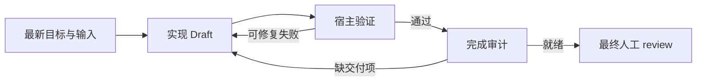

# 核心 Feature：默认 Goal 驱动的自主 Draft 交付

> 状态：已采纳的产品与架构基线（2026-10-09）；完整 Goal 执行闭环待实现。当前代码能力见 [当前架构](./current-architecture.md)，决策见 [ADR-0055](./adr/ADR-0055-goal-driven-draft-delivery.md)。

## 1. 默认认知

**用户交给 agent-cord 的是交付目标。系统在约定的权限与预算内，自主完成调研、计划、实现、自测、失败修复和交付整理，直到形成可供 human review 的 Draft。**

典型目标：实现一项功能，交付代码变更、针对当前代码的实际自测证据和 human review 指南。目标与验收边界明确、必要输入和依赖可用时，happy path 的中途人工干预次数应为 **0**。普通测试失败可在授权范围内自行修复时，也继续自动执行。

人保留最终 review、合入、发布、契约冻结及关键权限决策。日常节点推进、继续执行、测试与可修复失败无需逐次人工确认；必要事实、产品取舍或授权缺失时再升级。目标交付就绪与人工验收通过是两个不同结果。

这项原则覆盖 ACP、headless CLI 和自定义 agent。ACP 是通信协议；底层 agent 可以提供自己的持续执行能力，宿主仍负责目标生命周期、完成审计、恢复与权限控制。平台语义不依赖某家 CLI 是否有名为 `goal` 的原生模式。

## 2. 目标与交付契约

开始执行前，确定以下内容；可从 PRD、仓库规范和已发布的 SDLC 派生已有约定，无需让用户重复填写：

| 项目 | 最低要求 |
|---|---|
| 目标 | 预期行为、范围、明确的验收条件与已知限制 |
| 输入身份 | 需求、工作流版本、agent 配置身份、实际源码与依赖范围 |
| 执行权限 | 可读写的工作区、工具/命令和可逆操作范围；外部副作用与关键权限单列 |
| 验证要求 | 必需的测试、类型检查、构建或场景验收；按风险选择，已有团队最低集必须执行 |
| 资源边界 | 总时长、尝试次数、连续无进展上限；有可靠计量时再声明 token/费用预算 |
| 交付产物 | 代码变更、自测证据、human review 指南及它们对应的版本身份 |

默认代码交付包包含：

1. **代码 Draft**：可定位的分支或隔离工作区、变更 diff、相关测试和必要文档；标明提交基线及未提交变更。
2. **自测证据**：实际执行的命令、工作目录、排除凭据的环境摘要、退出状态、结果摘要及日志定位；绑定被测输入与源码内容身份。测试没有执行、失败、超时、被取消或证据过期时均不得标为通过。
3. **Human review 指南**：目标与完成项、主要行为变化、重点文件/符号、验收条件对应的测试证据、复现与操作路径、风险、未覆盖项和待人决定事项。涉及 UI 时附实际截图或操作路径，涉及协议时链接 ADR。

review 指南用于降低审查定位成本，不能代替代码与证据。产物路径由工作流声明，代码 Draft 可以在隔离检出中；不把示例文档名当作已实现的固定协议。

## 3. 宿主负责目标闭环

逻辑执行顺序如下；这些名称描述设计职责，不是新增事件或 API：

- driver 的 `end_turn`、退出码 0 或 `agent.task.completed=ok` 只说明一次调用结束；宿主审计尚未通过时继续执行。
- 宿主观察验证器的实际执行结果，核验必需检查、当前源码/依赖身份及交付产物。模型回复“已通过”或一份测试报告不能独立放行。
- 完成判定必须同时满足约定验收条件、当前验证通过、交付包齐备、权限与新鲜度检查通过；无法判断时 fail-closed。机器验证证明声明范围内的结果，不能证明全部业务正确或代替最终人审。
- 普通测试失败、缺文档或 Draft 不完整时，把结构化失败摘要和相关日志定位反馈给 worker，在剩余预算内修复，再运行受影响检查及要求的回归。不能靠删除必需测试、降低验收条件或把失败改成 warning 达成目标。
- 验证器和完成判定由宿主控制；实现者不能自行改写通过事实。若 agent 与验证器共享可写环境，仍需补充隔离与证据完整性保障，不能仅凭 hash 声称抗篡改。
- 各次尝试使用最新快照与自包含上下文；必要时新建 agent 会话。目标可跨会话持续，外部 session ID 仅为执行回执，不是恢复事实来源。
- 代码或必要输入变化后旧验证、报告与交付就绪状态重新核验；人工 review 绑定具体交付版本，旧选择不能批准新代码。

执行状态与检查结果仍经 `session.events.append` 留痕。确定性的宿主决策位于现有 workflow/NodeRunner 生命周期内；不得额外建立一套独立推进 SDLC 的状态机，也不得伪造或回滚已退出节点。

## 4. 什么情况下升级人工

| 情况 | 自动处理边界 | 人收到的内容 |
|---|---|---|
| 缺必要事实或存在实质歧义 | 先检索授权范围内资料；无法确定且会影响验收时升级，不猜业务结论 | 缺什么、影响、有限选项与推荐理由 |
| 需要新的权限或关键决策 | 既有授权范围内操作自行推进；越界操作等待明确授权，关键 gate 保留人工 | 所需权限/决策、范围、后果与替代方案 |
| 外部依赖不可用 | 做有界重试和允许的恢复；凭据缺失、服务持续不可用等无法本地修复时升级 | 实际错误、已尝试措施、最小所需帮助 |
| 持续无进展 | 按验收条件推进、未解决失败集合和产物变化判断；不能仅以模型声称有进展续跑 | 重复失败、尝试历史、剩余工作与建议 |
| 资源预算耗尽 | 停止新增尝试、保留 checkpoint；不冒称完成，不自动扩预算 | 已交付部分、未完成项、消耗与续跑所需预算 |

“本轮回复结束”“一个常规测试首次失败”“进入下一个节点”都不是独立的人工升级理由。ACP permission 请求应按宿主已有授权策略处理；协议请求本身不等于必须找人，未知或超范围请求仍拒绝或升级，不能全量自动批准。

升级只挂起受影响的执行范围，避免重复提问；有独立且仍获授权的工作时可继续。人工答复进入事实与最新输入后，重新核验再续跑。没有答复、没有授权或等待超时均不视为同意。

用户始终可取消或纠偏。恢复以事件流与当前输入/产物为依据，不重复执行仍有效的工作；副作用结果未知时先对账，不盲目重放。交付就绪后停止执行并等待最终 review，不自行扩展目标。

## 5. 验收与度量

1. ACP 与 headless 在输入充足的真实开发目标上，从启动到交付就绪均无中途人工操作；最终 review 单独计数。
2. 植入普通测试失败后，系统自动修复并重新验证；若持续失败达到声明上限，则保留证据并发起明确升级。
3. driver 提前结束、空产物、测试未执行、伪造“全绿”文本或缺 review 指南时，完成审计拒绝交付就绪。
4. 代码、依赖或目标变更使旧证据失效；中断/冷恢复不重复有效工作，部分验证与未知副作用不能冒充成功。
5. 权限越界、外部阻塞、无进展、预算耗尽与取消均能结束活动调用并保留可恢复状态；不生成虚假人工批准。
6. 人工 reviewer 能从指南找到变更与实际证据；未经人工决定不合入、不发布、不通过关键 gate。

关注目标交付率、首次交付的人审接受率、过期/错误放行率、每目标成本和耗时、中途干预率与干预原因。按任务风险/难度分桶，单列最终 review；“大多数是 happy path”是待真实样本验证的产品假设，不能以隐藏失败或绕过授权来压低干预率。

## 6. 当前基础与实现差距

| 能力 | 当前状态 |
|---|---|
| ACP/headless、自定义 agent、节点执行与取消 | 已实现 |
| 最新快照、输入/产物指纹、checkpoint 校验、版本化审批 | 已实现 |
| `verification.completed`、源码范围、验证 checker 与证据新鲜度 | 已实现；接入结果事实不等于自动运行并可信观察测试 |
| `run.retry` 的失败摘要、次数与退避 | 已实现；成功任务后的验证失败尚不会自动触发实现修复闭环 |
| Goal 交付包、宿主完成审计、自动验证与修复循环、目标级预算与卡点治理 | 待实现 |
| 独立 Context Session Agent | 已实现一次 Draft 提议与人工采用；尚未承担自动 Goal 监督循环 |

真实 agent 开发流程的设计默认是 Goal；零外部依赖的离线 `simple-sdlc` 继续用于验证平台内核。现有 API、示例与人工 gate 未因本次文档采纳而改变。后续按 [路线图](./10-roadmap.md) 分步实现，跨模块协议先更新 ADR。
